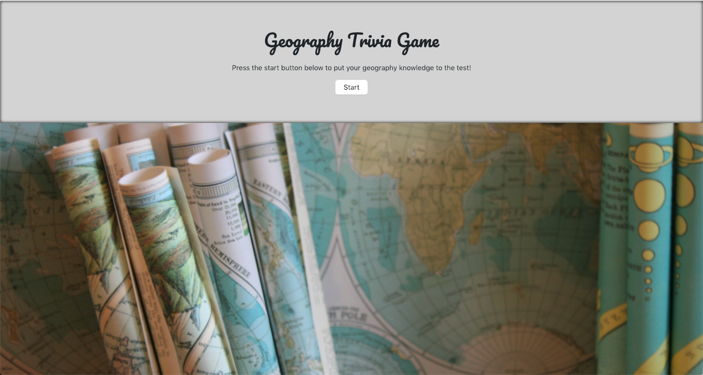

This is an app for users looking to test their geography knowledge. After the user starts the game, she or he answers several true or false questions. The user has 30 seconds to complete the quiz. After this time expires, the user sees a game over screen that lists how many right answers, wrong answers, and unanswered questions she or he had. Credit for the background image goes to the user Ruthie from unsplash.com: https://unsplash.com/photos/a6mfMjCFkII. To use the app, please visit the following URL: https://tomstone76.github.io/TriviaGame/

Technologies used: JavaScript, JQuery, HTML, CSS, and Bootstrap

© 2018 Thomas Joseph Stone